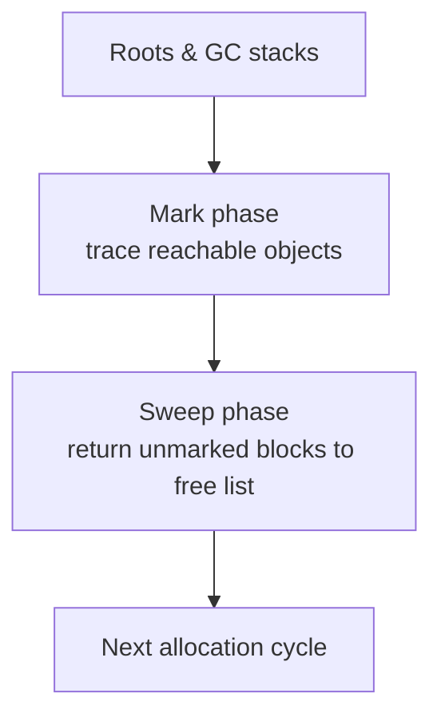
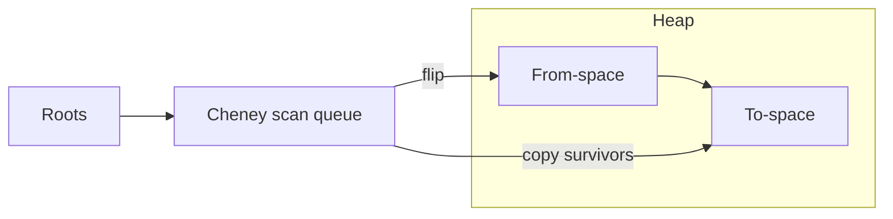
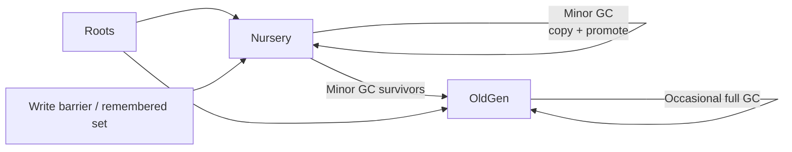

# Mainstream GC Algorithms in Minimalisp

Minimalisp bundles three garbage collectors—mark-sweep, semispace copying, and generational—because these families cover the dominant strategies used in contemporary runtimes (CPython, V8, JVM hot spots, and most managed-language VMs mix and match them). Each backend lives under `src/gc/` and plugs into the shared `gc_runtime` shim, so you can experiment with allocator behavior without touching the interpreter.

## Mark-Sweep (Non-Moving)

Implemented in `src/gc/mark_sweep.c`, this collector performs two passes over the heap:

- **How it works:** Roots are traced recursively, setting a mark bit for each reachable object. The sweep phase walks every allocation header, freeing unmarked blocks and clearing the bit for the next cycle.
- **Why it is mainstream:** Mark-sweep offers predictable memory overhead (no copy reserve) and remains the baseline collector in many systems where memory footprint matters (embedded Lua, CPython, Ruby’s “major” GC).
- **Trade-offs:** Pauses scale with heap size, and fragmentation accumulates because objects are never moved. Minimalisp’s implementation keeps a linked list of headers, which is simple but scans the entire heap each collection.

## Semispace Copying (Cheney)

Implemented in `src/gc/copying.c`, this backend divides the heap into two equal regions and copies live objects between them.

- **How it works:** During collection, live objects are copied (and compacted) into the empty half (“to-space”). Pointer fields are updated on the fly via forwarding addresses, and the spaces swap roles when the pass finishes.
- **Why it is mainstream:** Copying collectors power the “nursery” in most modern runtimes (V8, JVM, .NET) because they keep pause time proportional to live data and eliminate fragmentation automatically.
- **Trade-offs:** Requires reserving half the heap as backup space, and copying high-survival heaps becomes expensive. Minimalisp’s semispace backend is ideal for short-lived workloads and benchmarking compacting behavior.

## Generational (Nursery + Tenured Heap)

Implemented in `src/gc/generational.c`, this collector layers a semispace nursery atop an older mark-sweep space, exploiting the generational hypothesis.

- **How it works:** Most allocations land in the nursery (collected with a fast copying pass). Survivors are promoted to the old generation, which is collected with a mark-sweep pass only when necessary. A write barrier tracks pointers from tenured objects into the nursery so minor collections remain precise.
- **Why it is mainstream:** Generational collectors capture the best of both worlds: fast minor pauses for young objects plus lower promotion and scanning pressure for long-lived data. This mirrors the structure used by HotSpot’s Parallel Scavenge, V8’s Orinoco, and many other production VMs.
- **Trade-offs:** More complex bookkeeping (remembered sets, promotion thresholds) and sensitivity to tuning knobs, but the payoff is superior throughput on real workloads with mixed lifetimes.

## Choosing Between Them

| Backend | Best For | Key Strength | Primary Trade-off |
|---------|----------|--------------|-------------------|
| Mark-Sweep | Memory-constrained or embeddable builds | Minimal overhead, steady behavior | Long pauses, fragmentation |
| Semispace Copying | Allocation-heavy scripts, stress testing | Pause time proportional to live data, natural compaction | Needs 2× memory, copies survivors every cycle |
| Generational | Real-world sessions with mixed lifetimes | Short minor pauses, fewer major cycles | Requires write barrier + tuning |

Use `GC_BACKEND=mark` (default), `GC_BACKEND=copying`, or `GC_BACKEND=generational` with `make test-native` or the WASM harness to compare them in practice. Because these three techniques underpin most production collectors today, understanding how each behaves in Minimalisp gives you a solid foundation for evaluating GC strategies elsewhere.
